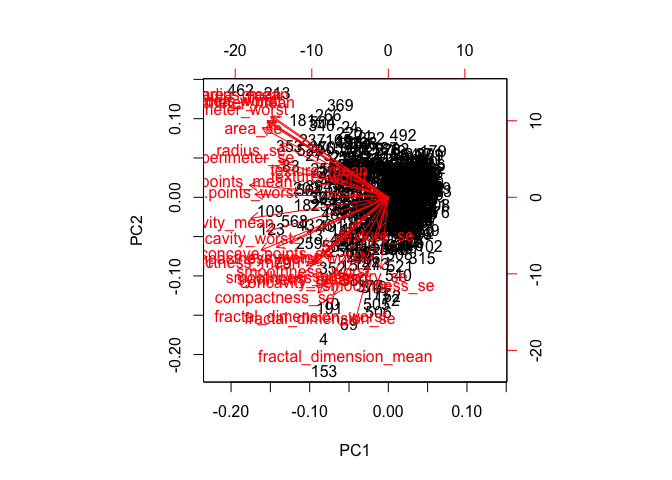
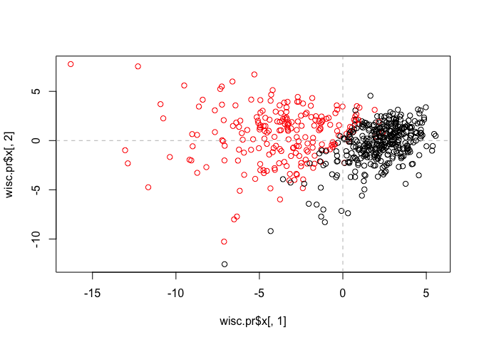
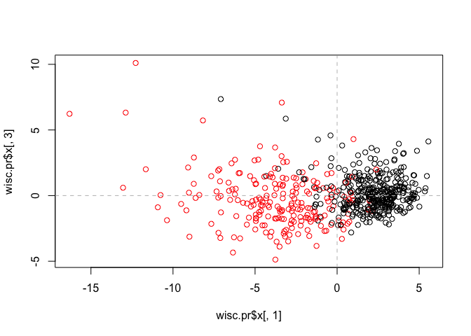
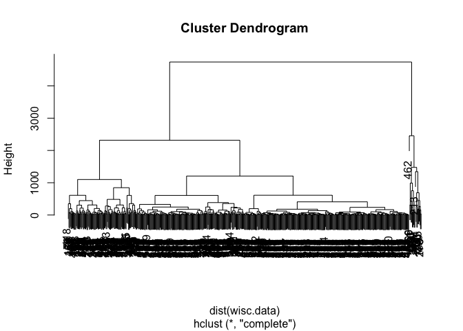
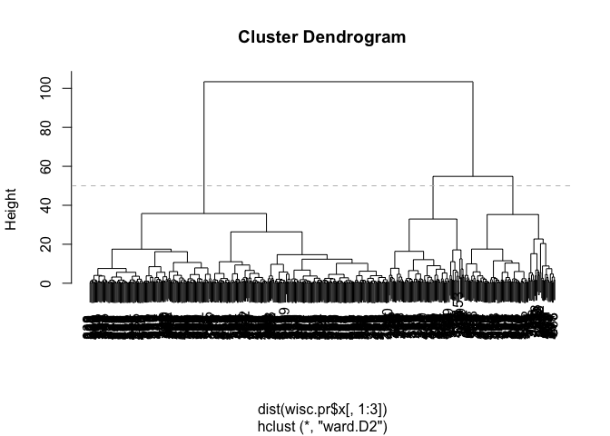
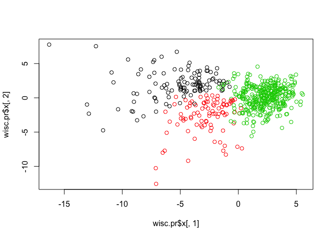
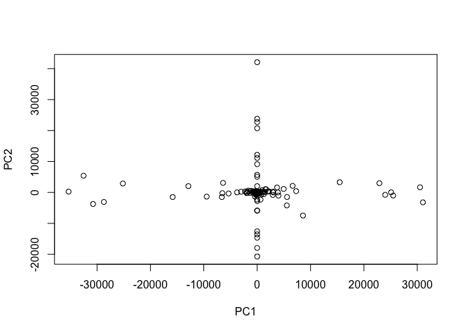
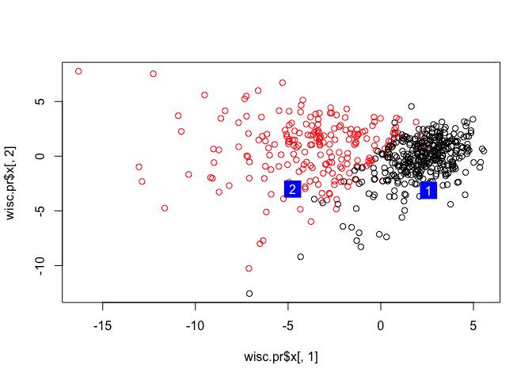

lecture10
================
Anastasia Pimentel
2/6/2020

\#\#Unsupervised Learning Analysis of Human Breast Cancer Cells
Importing our data from University of Wisconsion Medical Center.

``` r
wisc.df <- read.csv("WisconsinCancer.csv")
```

Viewing the data:

``` r
View(wisc.df)
head(wisc.df)
```

    ##         id diagnosis radius_mean texture_mean perimeter_mean area_mean
    ## 1   842302         M       17.99        10.38         122.80    1001.0
    ## 2   842517         M       20.57        17.77         132.90    1326.0
    ## 3 84300903         M       19.69        21.25         130.00    1203.0
    ## 4 84348301         M       11.42        20.38          77.58     386.1
    ## 5 84358402         M       20.29        14.34         135.10    1297.0
    ## 6   843786         M       12.45        15.70          82.57     477.1
    ##   smoothness_mean compactness_mean concavity_mean concave.points_mean
    ## 1         0.11840          0.27760         0.3001             0.14710
    ## 2         0.08474          0.07864         0.0869             0.07017
    ## 3         0.10960          0.15990         0.1974             0.12790
    ## 4         0.14250          0.28390         0.2414             0.10520
    ## 5         0.10030          0.13280         0.1980             0.10430
    ## 6         0.12780          0.17000         0.1578             0.08089
    ##   symmetry_mean fractal_dimension_mean radius_se texture_se perimeter_se
    ## 1        0.2419                0.07871    1.0950     0.9053        8.589
    ## 2        0.1812                0.05667    0.5435     0.7339        3.398
    ## 3        0.2069                0.05999    0.7456     0.7869        4.585
    ## 4        0.2597                0.09744    0.4956     1.1560        3.445
    ## 5        0.1809                0.05883    0.7572     0.7813        5.438
    ## 6        0.2087                0.07613    0.3345     0.8902        2.217
    ##   area_se smoothness_se compactness_se concavity_se concave.points_se
    ## 1  153.40      0.006399        0.04904      0.05373           0.01587
    ## 2   74.08      0.005225        0.01308      0.01860           0.01340
    ## 3   94.03      0.006150        0.04006      0.03832           0.02058
    ## 4   27.23      0.009110        0.07458      0.05661           0.01867
    ## 5   94.44      0.011490        0.02461      0.05688           0.01885
    ## 6   27.19      0.007510        0.03345      0.03672           0.01137
    ##   symmetry_se fractal_dimension_se radius_worst texture_worst perimeter_worst
    ## 1     0.03003             0.006193        25.38         17.33          184.60
    ## 2     0.01389             0.003532        24.99         23.41          158.80
    ## 3     0.02250             0.004571        23.57         25.53          152.50
    ## 4     0.05963             0.009208        14.91         26.50           98.87
    ## 5     0.01756             0.005115        22.54         16.67          152.20
    ## 6     0.02165             0.005082        15.47         23.75          103.40
    ##   area_worst smoothness_worst compactness_worst concavity_worst
    ## 1     2019.0           0.1622            0.6656          0.7119
    ## 2     1956.0           0.1238            0.1866          0.2416
    ## 3     1709.0           0.1444            0.4245          0.4504
    ## 4      567.7           0.2098            0.8663          0.6869
    ## 5     1575.0           0.1374            0.2050          0.4000
    ## 6      741.6           0.1791            0.5249          0.5355
    ##   concave.points_worst symmetry_worst fractal_dimension_worst  X
    ## 1               0.2654         0.4601                 0.11890 NA
    ## 2               0.1860         0.2750                 0.08902 NA
    ## 3               0.2430         0.3613                 0.08758 NA
    ## 4               0.2575         0.6638                 0.17300 NA
    ## 5               0.1625         0.2364                 0.07678 NA
    ## 6               0.1741         0.3985                 0.12440 NA

``` r
tail(wisc.df)
```

    ##         id diagnosis radius_mean texture_mean perimeter_mean area_mean
    ## 564 926125         M       20.92        25.09         143.00    1347.0
    ## 565 926424         M       21.56        22.39         142.00    1479.0
    ## 566 926682         M       20.13        28.25         131.20    1261.0
    ## 567 926954         M       16.60        28.08         108.30     858.1
    ## 568 927241         M       20.60        29.33         140.10    1265.0
    ## 569  92751         B        7.76        24.54          47.92     181.0
    ##     smoothness_mean compactness_mean concavity_mean concave.points_mean
    ## 564         0.10990          0.22360        0.31740             0.14740
    ## 565         0.11100          0.11590        0.24390             0.13890
    ## 566         0.09780          0.10340        0.14400             0.09791
    ## 567         0.08455          0.10230        0.09251             0.05302
    ## 568         0.11780          0.27700        0.35140             0.15200
    ## 569         0.05263          0.04362        0.00000             0.00000
    ##     symmetry_mean fractal_dimension_mean radius_se texture_se perimeter_se
    ## 564        0.2149                0.06879    0.9622      1.026        8.758
    ## 565        0.1726                0.05623    1.1760      1.256        7.673
    ## 566        0.1752                0.05533    0.7655      2.463        5.203
    ## 567        0.1590                0.05648    0.4564      1.075        3.425
    ## 568        0.2397                0.07016    0.7260      1.595        5.772
    ## 569        0.1587                0.05884    0.3857      1.428        2.548
    ##     area_se smoothness_se compactness_se concavity_se concave.points_se
    ## 564  118.80      0.006399        0.04310      0.07845           0.02624
    ## 565  158.70      0.010300        0.02891      0.05198           0.02454
    ## 566   99.04      0.005769        0.02423      0.03950           0.01678
    ## 567   48.55      0.005903        0.03731      0.04730           0.01557
    ## 568   86.22      0.006522        0.06158      0.07117           0.01664
    ## 569   19.15      0.007189        0.00466      0.00000           0.00000
    ##     symmetry_se fractal_dimension_se radius_worst texture_worst perimeter_worst
    ## 564     0.02057             0.006213       24.290         29.41          179.10
    ## 565     0.01114             0.004239       25.450         26.40          166.10
    ## 566     0.01898             0.002498       23.690         38.25          155.00
    ## 567     0.01318             0.003892       18.980         34.12          126.70
    ## 568     0.02324             0.006185       25.740         39.42          184.60
    ## 569     0.02676             0.002783        9.456         30.37           59.16
    ##     area_worst smoothness_worst compactness_worst concavity_worst
    ## 564     1819.0          0.14070           0.41860          0.6599
    ## 565     2027.0          0.14100           0.21130          0.4107
    ## 566     1731.0          0.11660           0.19220          0.3215
    ## 567     1124.0          0.11390           0.30940          0.3403
    ## 568     1821.0          0.16500           0.86810          0.9387
    ## 569      268.6          0.08996           0.06444          0.0000
    ##     concave.points_worst symmetry_worst fractal_dimension_worst  X
    ## 564               0.2542         0.2929                 0.09873 NA
    ## 565               0.2216         0.2060                 0.07115 NA
    ## 566               0.1628         0.2572                 0.06637 NA
    ## 567               0.1418         0.2218                 0.07820 NA
    ## 568               0.2650         0.4087                 0.12400 NA
    ## 569               0.0000         0.2871                 0.07039 NA

The data has a weird empty X column\! Let’s clean this up and get rid of
it. Convert columns data 3-32 to a matrix. We don’t include the frist
two columns because they aren’t directly related to the biopsy data.

``` r
wisc.data <- as.matrix(wisc.df[,3:32])
```

How many patients are in the matrix?

``` r
nrow(wisc.data)
```

    ## [1] 569

How many malignet vs benign diagnosis were there?

``` r
diagnosis <- wisc.df$diagnosis
table(diagnosis)
```

    ## diagnosis
    ##   B   M 
    ## 357 212

How many column names are the mean of something?

``` r
length(grep("_mean", colnames(wisc.data), value=TRUE))
```

    ## [1] 10

Now we can see if we need to scale our data in the
    PCA.

``` r
round(apply(wisc.data, 2, sd), 2)
```

    ##             radius_mean            texture_mean          perimeter_mean 
    ##                    3.52                    4.30                   24.30 
    ##               area_mean         smoothness_mean        compactness_mean 
    ##                  351.91                    0.01                    0.05 
    ##          concavity_mean     concave.points_mean           symmetry_mean 
    ##                    0.08                    0.04                    0.03 
    ##  fractal_dimension_mean               radius_se              texture_se 
    ##                    0.01                    0.28                    0.55 
    ##            perimeter_se                 area_se           smoothness_se 
    ##                    2.02                   45.49                    0.00 
    ##          compactness_se            concavity_se       concave.points_se 
    ##                    0.02                    0.03                    0.01 
    ##             symmetry_se    fractal_dimension_se            radius_worst 
    ##                    0.01                    0.00                    4.83 
    ##           texture_worst         perimeter_worst              area_worst 
    ##                    6.15                   33.60                  569.36 
    ##        smoothness_worst       compactness_worst         concavity_worst 
    ##                    0.02                    0.16                    0.21 
    ##    concave.points_worst          symmetry_worst fractal_dimension_worst 
    ##                    0.07                    0.06                    0.02

Since the SDs are so different, these must be in different scales. So,
we’ll need to scale.

PCA time\!

``` r
wisc.pr <- prcomp(wisc.data, scale=TRUE)
summary(wisc.pr)
```

    ## Importance of components:
    ##                           PC1    PC2     PC3     PC4     PC5     PC6     PC7
    ## Standard deviation     3.6444 2.3857 1.67867 1.40735 1.28403 1.09880 0.82172
    ## Proportion of Variance 0.4427 0.1897 0.09393 0.06602 0.05496 0.04025 0.02251
    ## Cumulative Proportion  0.4427 0.6324 0.72636 0.79239 0.84734 0.88759 0.91010
    ##                            PC8    PC9    PC10   PC11    PC12    PC13    PC14
    ## Standard deviation     0.69037 0.6457 0.59219 0.5421 0.51104 0.49128 0.39624
    ## Proportion of Variance 0.01589 0.0139 0.01169 0.0098 0.00871 0.00805 0.00523
    ## Cumulative Proportion  0.92598 0.9399 0.95157 0.9614 0.97007 0.97812 0.98335
    ##                           PC15    PC16    PC17    PC18    PC19    PC20   PC21
    ## Standard deviation     0.30681 0.28260 0.24372 0.22939 0.22244 0.17652 0.1731
    ## Proportion of Variance 0.00314 0.00266 0.00198 0.00175 0.00165 0.00104 0.0010
    ## Cumulative Proportion  0.98649 0.98915 0.99113 0.99288 0.99453 0.99557 0.9966
    ##                           PC22    PC23   PC24    PC25    PC26    PC27    PC28
    ## Standard deviation     0.16565 0.15602 0.1344 0.12442 0.09043 0.08307 0.03987
    ## Proportion of Variance 0.00091 0.00081 0.0006 0.00052 0.00027 0.00023 0.00005
    ## Cumulative Proportion  0.99749 0.99830 0.9989 0.99942 0.99969 0.99992 0.99997
    ##                           PC29    PC30
    ## Standard deviation     0.02736 0.01153
    ## Proportion of Variance 0.00002 0.00000
    ## Cumulative Proportion  1.00000 1.00000

So, PC1 captures 44.27% of the original varience. We need 3 PCs to cover
at least 70% of the original variance. 7 PCs are needed for at least 90%
of the original variance. Now we need to find the PCA elbow:

``` r
biplot(wisc.pr)
```

<!-- --> A hot
mess\! We need a better way to graph this.

Let’s take a closer look at what we have.

``` r
attributes(wisc.pr)
```

    ## $names
    ## [1] "sdev"     "rotation" "center"   "scale"    "x"       
    ## 
    ## $class
    ## [1] "prcomp"

``` r
plot(wisc.pr$x[,1], wisc.pr$x[,2], col=diagnosis)
abline(h=0, col="grey", lty=2)
abline(v=0, col="grey", lty=2)
```

<!-- -->

``` r
plot(wisc.pr$x[,1], wisc.pr$x[,3], col=diagnosis)
abline(h=0, col="grey", lty=2)
abline(v=0, col="grey", lty=2)
```

<!-- -->

``` r
hc <- hclust(dist(wisc.data))
plot(hc)
```

<!-- -->

Totally unclear\! The raw data is too confusing.

``` r
wisc.pr.hclust <- hclust(dist(wisc.pr$x[,1:3]), method="ward.D2")
plot(wisc.pr.hclust)
abline(h=50, col="grey", lty=2)
```

<!-- -->

``` r
cutree(wisc.pr.hclust, k=50)
```

    ##   [1]  1  2  3  4  5  6  7  8  6  4  9 10 11 12  6  6 13 14  2 13 15 16 17  2  3
    ##  [26]  1  6 18 14 12  3  6 14  3 14 10 10 19 20 21 22 21 11 21 13 14 16 21 23 24
    ##  [51] 19 22 19  5 24 19  3 10 19 25 26 26 17 26 21 10 16 19 27 19  2 28 14 13 23
    ##  [76] 12 29  1 30 31 31 21 32 33 31  5 12 34 15 35 24 12 22 24 10  5 36 36 23 35
    ## [101] 24 25 19 15 36  6 37 23 30 31 26 29 38 39 25 31 26 14 17 12 23  5 40 13 41
    ## [126] 22 13  2 35  3 15  7  7 24  2 31 20 23 33 36 42 12 31 23 19 39  8 29 13 22
    ## [151] 31 43 44 42 15 31  5  9 23 42 29 18  3 29  2 22 42 12  5 24 31 24 14 36 45
    ## [176] 16 28 10 46 19 32  1  7 36 13 16 24 23 19 19 27 20 45  8  8 23 35 18 34 21
    ## [201] 31  7 47 17 15 13 16  9 21 22 18 23 48 49  8 21 37 36  5  2 23 15 16 10 24
    ## [226] 24 42 13 13  6 14 42 19  2 16 41 32  2 12 34 24 42  8 41  5 26 19 21 31 31
    ## [251] 47 19  1  7 34 35 47 17 11 14 34  9 18 22  7 50 29 41 31 39 46 23 47 16  9
    ## [276] 29 19  9 22 23  3 20 34 10 31 19 29 46 49 36 49 13 15 23 23 22 19 20 22 36
    ## [301] 47 31 33 16 19 19 42 16 46 46 23 22 31 42 26 46 46  7 38 45 39  2 31  1 23
    ## [326] 23 22 46 10 35 10 15 36 42 19  5 31  3 16 50 35 15 15  5 31 26 19 24 23 31
    ## [351] 19 27 32 35 36 29 37 22 36 16 46 41 31  9 22  2 33 23 50 32 14 22 34  2 23
    ## [376] 13 38 22 15  6 15 23 31 37 23 12 31 22 39 33 42 36 14  1 31 22 13 41 42 31
    ## [401] 17 23 31 23 19 36 24 29 34 31 23 23 16 13  9 31 26 33 23 19 31 35 31 13 26
    ## [426] 19 37 31 19 46 17 37  3  5 24 21 31 41 41 22 37  5 22 36  7 15 34 23 24  2
    ## [451] 29  5 31 13 23 41 31 22 22 19  5 48 22 23 22  8 13 16 33 37 16 20 24 45 15
    ## [476] 23 13 22 31 17 23 22 15 23 13 38 22  3 31 24 23  9  5 45 41 24 21 23  5  3
    ## [501] 13  8 15 50 43 43 15 39 24 17 31 22 21 24 24 31 34 34 15 15 39 32 42 15 16
    ## [526] 25 13 23 29 31 31 15 23 18 31  3 35 37 36 39 26 35 24 41 31 41 42 16 16 36
    ## [551] 45 31 41 36 41 36 36 45 12 29 12 45 17 47 47 18 12  1 45

Lets get our clusters out of the tree.

``` r
grps3 <- cutree(wisc.pr.hclust, k=3)
table(grps3)
```

    ## grps3
    ##   1   2   3 
    ## 111  92 366

This is how many people are in each cluster.

``` r
plot(wisc.pr$x[,1], wisc.pr$x[,2], col=grps3)
```

<!-- --> So what
color means what?

``` r
table(grps3, wisc.df$diagnosis)
```

    ##      
    ## grps3   B   M
    ##     1   0 111
    ##     2  24  68
    ##     3 333  33

xxxxxxxxxxxxxxxxxxxxxxxxxx

``` r
pr.var <- wisc.pr$sdev^2

pve <- wisc.pr$x/pr.var


plot(pve)
```

<!-- -->

xxxxxxxxxxxxxxxxxxxxxxxxxxx

Open new data and use predict function with our previous PCA model and
new data.

``` r
new <- read.csv("new_samples.csv")
new
```

    ##   radius_mean texture_mean perimeter_mean area_mean smoothness_mean
    ## 1       8.598        20.98          54.66     221.8          0.1243
    ## 2      14.250        22.15          96.42     645.7          0.1049
    ##   compactness_mean concavity_mean concave.points_mean symmetry_mean
    ## 1          0.08963         0.0300            0.009259        0.1828
    ## 2          0.20080         0.2135            0.086530        0.1949
    ##   fractal_dimension_mean radius_se texture_se perimeter_se area_se
    ## 1                0.06757    0.3582      2.067        2.493   18.39
    ## 2                0.07292    0.7036      1.268        5.373   60.78
    ##   smoothness_se compactness_se concavity_se concave.points_se symmetry_se
    ## 1      0.011930        0.03162      0.03000          0.009259     0.03357
    ## 2      0.009407        0.07056      0.06899          0.018480     0.01700
    ##   fractal_dimension_se radius_worst texture_worst perimeter_worst area_worst
    ## 1             0.003048        9.565         27.04           62.06      273.9
    ## 2             0.006113       17.670         29.51          119.10      959.5
    ##   smoothness_worst compactness_worst concavity_worst concave.points_worst
    ## 1           0.1639            0.1698         0.09001              0.02778
    ## 2           0.1640            0.6247         0.69220              0.17850
    ##   symmetry_worst fractal_dimension_worst
    ## 1         0.2972                 0.07712
    ## 2         0.2844                 0.11320

``` r
npc <- predict(wisc.pr, newdata = new)
npc
```

    ##            PC1       PC2        PC3        PC4       PC5        PC6        PC7
    ## [1,]  2.576616 -3.135913  1.3990492 -0.7631950  2.781648 -0.8150185 -0.3959098
    ## [2,] -4.754928 -3.009033 -0.1660946 -0.6052952 -1.140698 -1.2189945  0.8193031
    ##             PC8       PC9       PC10      PC11      PC12      PC13     PC14
    ## [1,] -0.2307350 0.1029569 -0.9272861 0.3411457  0.375921 0.1610764 1.187882
    ## [2,] -0.3307423 0.5281896 -0.4855301 0.7173233 -1.185917 0.5893856 0.303029
    ##           PC15       PC16        PC17        PC18        PC19       PC20
    ## [1,] 0.3216974 -0.1743616 -0.07875393 -0.11207028 -0.08802955 -0.2495216
    ## [2,] 0.1299153  0.1448061 -0.40509706  0.06565549  0.25591230 -0.4289500
    ##            PC21       PC22       PC23       PC24        PC25         PC26
    ## [1,]  0.1228233 0.09358453 0.08347651  0.1223396  0.02124121  0.078884581
    ## [2,] -0.1224776 0.01732146 0.06316631 -0.2338618 -0.20755948 -0.009833238
    ##              PC27        PC28         PC29         PC30
    ## [1,]  0.220199544 -0.02946023 -0.015620933  0.005269029
    ## [2,] -0.001134152  0.09638361  0.002795349 -0.019015820

``` r
plot(wisc.pr$x[,1], wisc.pr$x[,2], col=wisc.df$diagnosis)
points(npc[,1], npc[,2], col="blue", pch=15, cex=3)
text(npc[,1], npc[,2], labels=c(1,2), col="white")
```

<!-- -->
