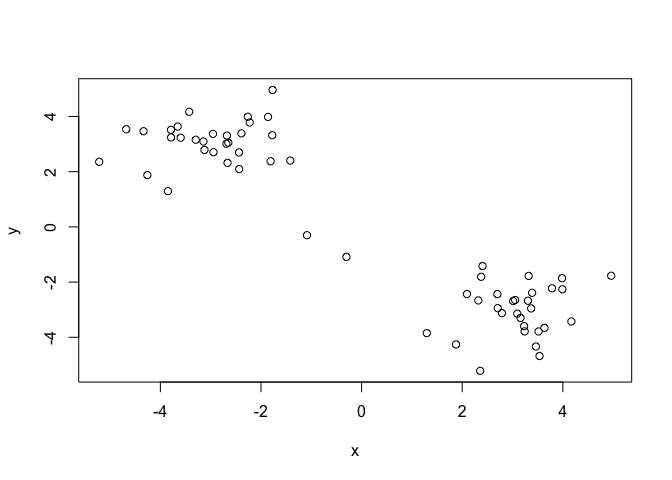
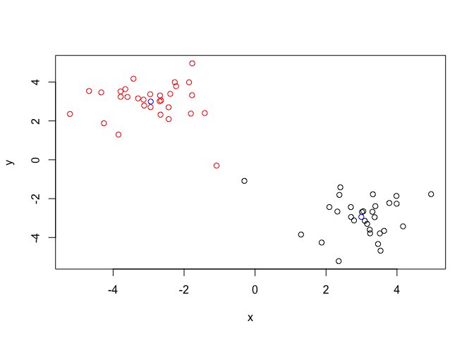
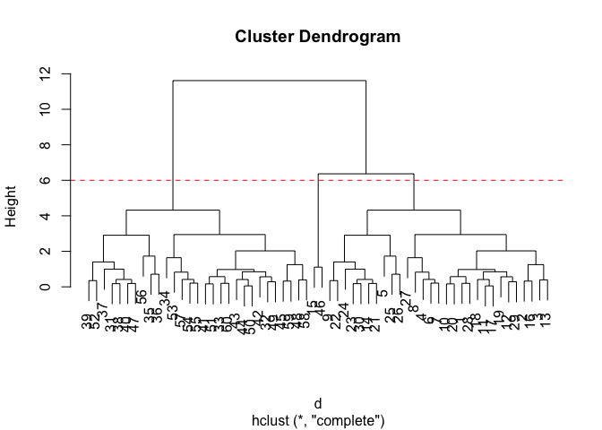
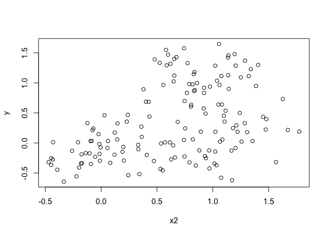
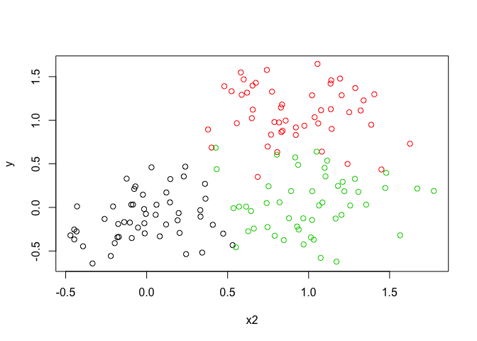
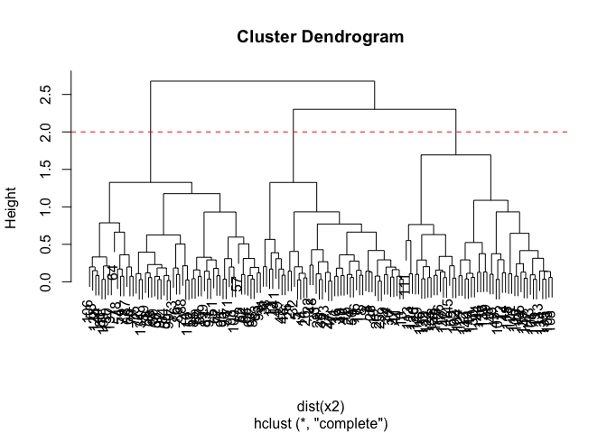
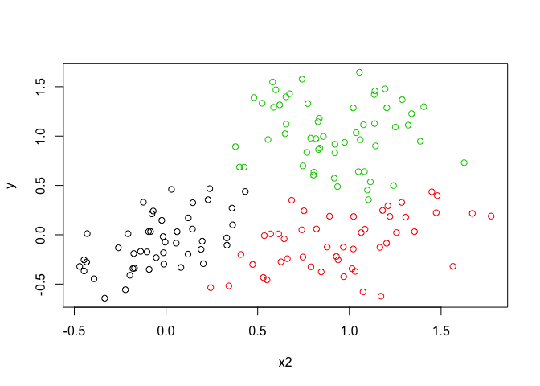
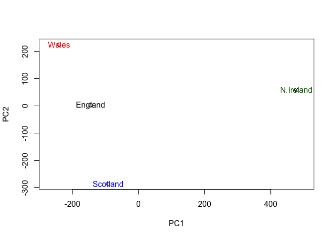
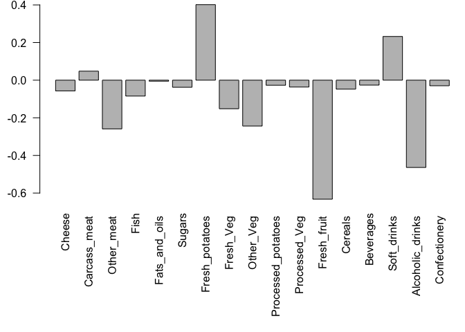

lecture9
================
Anastasia Pimentel
2/4/2020

\#\#K-means clustering

Generating data for our cluster:

``` r
tmp <- c(rnorm(30,-3), rnorm(30,3))
x <- cbind(x=tmp, y=rev(tmp))
plot(x)
```

<!-- -->

Now we use k-means:

``` r
k <- kmeans(x,centers=2, nstart=20)
k
```

    ## K-means clustering with 2 clusters of sizes 30, 30
    ## 
    ## Cluster means:
    ##           x         y
    ## 1  2.994468 -2.939863
    ## 2 -2.939863  2.994468
    ## 
    ## Clustering vector:
    ##  [1] 2 2 2 2 2 2 2 2 2 2 2 2 2 2 2 2 2 2 2 2 2 2 2 2 2 2 2 2 2 2 1 1 1 1 1 1 1 1
    ## [39] 1 1 1 1 1 1 1 1 1 1 1 1 1 1 1 1 1 1 1 1 1 1
    ## 
    ## Within cluster sum of squares by cluster:
    ## [1] 55.85422 55.85422
    ##  (between_SS / total_SS =  90.4 %)
    ## 
    ## Available components:
    ## 
    ## [1] "cluster"      "centers"      "totss"        "withinss"     "tot.withinss"
    ## [6] "betweenss"    "size"         "iter"         "ifault"

Q. How many points are in each cluster? There are 30 points each. Q.
What ‘component’ of your result object details - cluster size? - Use
“size.” - cluster assignment/membership? Use “cluster.” - cluster
center? Use “centers.”

Plot x colored by the kmeans cluster assignment and add cluster centers
as blue points

``` r
plot(x, col=k$cluster)
points(k$centers, col="blue")
```

<!-- -->

\#\#Hierarchical clustering Now we’ll practice hierarchical clustering
using the hclust function.

``` r
d <- dist(x)
hc <- hclust(d)
plot(hc)


plot(hc)
abline(h=6, col="red", lty=2)
```

<!-- -->

``` r
cutree(hc, h=6)
```

    ##  [1] 1 1 1 1 1 1 1 1 1 1 1 1 1 1 2 1 1 1 1 1 1 1 1 1 1 1 1 1 1 1 3 3 3 3 3 3 3 3
    ## [39] 3 3 3 3 3 3 3 2 3 3 3 3 3 3 3 3 3 3 3 3 3 3

What about unlcear data?

``` r
# Step 1. Generate some example data for clustering
x2 <- rbind(
  matrix(rnorm(100, mean=0, sd = 0.3), ncol = 2),   # c1
  matrix(rnorm(100, mean = 1, sd = 0.3), ncol = 2), # c2
  matrix(c(rnorm(50, mean = 1, sd = 0.3),           # c3
           rnorm(50, mean = 0, sd = 0.3)), ncol = 2))
colnames(x2) <- c("x2", "y")
# Step 2. Plot the data without clustering
plot(x2)
```

<!-- -->

``` r
# Step 3. Generate colors for known clusters
#         (just so we can compare to hclust results)
col <- as.factor( rep(c("c1","c2","c3"), each=50) )
plot(x2, col=col)
```

<!-- -->

Now to find cluster membership and tabulate them.

``` r
hc2 <- hclust(dist(x2))
plot(hc2)
abline(h=2, col="red", lty=2)
```

<!-- -->

``` r
ct <- cutree(hc2, h=2)
table(ct)
```

    ## ct
    ##  1  2  3 
    ## 46 48 56

``` r
#Now plot with colors for the clusters.

plot(x2, col=ct)
```

<!-- -->

\#\#PCA Now we’ll practice using PCA on lots of data.

``` r
x <- read.csv("UK_foods.csv", row.names=1)
x
```

    ##                     England Wales Scotland N.Ireland
    ## Cheese                  105   103      103        66
    ## Carcass_meat            245   227      242       267
    ## Other_meat              685   803      750       586
    ## Fish                    147   160      122        93
    ## Fats_and_oils           193   235      184       209
    ## Sugars                  156   175      147       139
    ## Fresh_potatoes          720   874      566      1033
    ## Fresh_Veg               253   265      171       143
    ## Other_Veg               488   570      418       355
    ## Processed_potatoes      198   203      220       187
    ## Processed_Veg           360   365      337       334
    ## Fresh_fruit            1102  1137      957       674
    ## Cereals                1472  1582     1462      1494
    ## Beverages                57    73       53        47
    ## Soft_drinks            1374  1256     1572      1506
    ## Alcoholic_drinks        375   475      458       135
    ## Confectionery            54    64       62        41

``` r
barplot(as.matrix(x), beside=T, col=rainbow(nrow(x)))
```

<!-- -->

``` r
pairs(x, col=rainbow(10), pch=16)
```

<!-- -->

Principal Component Analysis (PCA) with

``` r
pca <- prcomp( t(x) )
summary(pca)
```

    ## Importance of components:
    ##                             PC1      PC2      PC3       PC4
    ## Standard deviation     324.1502 212.7478 73.87622 4.189e-14
    ## Proportion of Variance   0.6744   0.2905  0.03503 0.000e+00
    ## Cumulative Proportion    0.6744   0.9650  1.00000 1.000e+00

``` r
#The summary isn't very useful, so lets dig deeper.
#Checking the attribute of pca. "x" is the new variables that the PCA funtion creates. 
attributes(pca)
```

    ## $names
    ## [1] "sdev"     "rotation" "center"   "scale"    "x"       
    ## 
    ## $class
    ## [1] "prcomp"

``` r
plot(pca$x[,1], pca$x[,2], xlab="PC1", ylab="PC2", xlim=c(-270,500))
text(pca$x[,1], pca$x[,2], colnames(x), col=c("black", "red", "blue", "darkgreen"))
```

<!-- -->

So N. Ireland is different. But different in what way?

``` r
par(mar=c(10, 3, 0.35, 0))
barplot( pca$rotation[,1], las=2 )
```

<!-- -->
