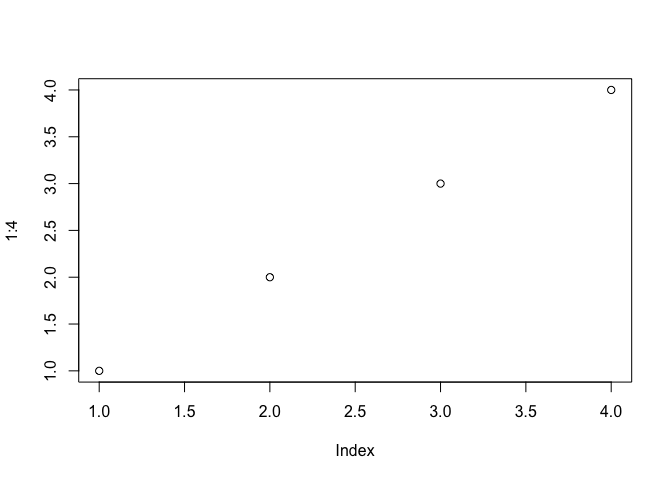
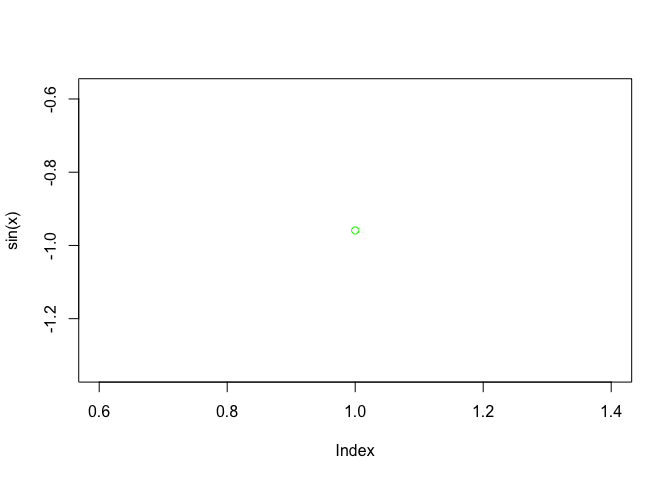
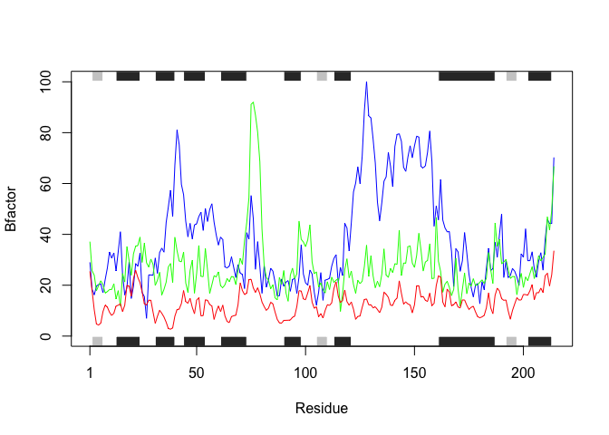
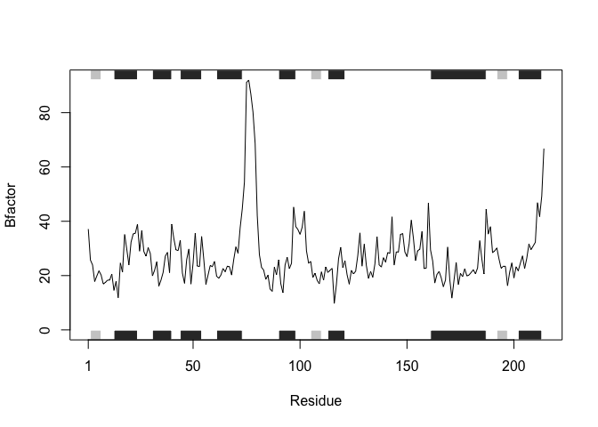

class6
================
Anastasia Pimentel
1/23/2020

# hello

## hello

### hello

``` r
# hello
plot(1:4)
```

<!-- -->

``` r
x <- 5

plot(sin(x), col="green")
```

<!-- -->

<http://www.google.com> \#\# R Markdown

This is an R Markdown document. Markdown is a simple formatting syntax
for authoring HTML, PDF, and MS Word documents. For more details on
using R Markdown see <http://rmarkdown.rstudio.com>.

When you click the **Knit** button a document will be generated that
includes both content as well as the output of any embedded R code
chunks within the document. You can embed an R code chunk like this:

``` r
summary(cars)
```

    ##      speed           dist       
    ##  Min.   : 4.0   Min.   :  2.00  
    ##  1st Qu.:12.0   1st Qu.: 26.00  
    ##  Median :15.0   Median : 36.00  
    ##  Mean   :15.4   Mean   : 42.98  
    ##  3rd Qu.:19.0   3rd Qu.: 56.00  
    ##  Max.   :25.0   Max.   :120.00

## Including Plots

You can also embed plots, for example:

<!-- -->

Note that the `echo = FALSE` parameter was added to the code chunk to
prevent printing of the R code that generated the plot.

### Lecture 6

About
readtables:

``` r
# Example of read.table. For read.table header is by default false, but for all other read.blah header is by default false.
# read.table("your file name", header="TRUE", sep="\t")
```

``` r
t1 <- read.table("test1.txt")
```

``` r
t1 <- read.table("test1.txt", sep = ",", header=TRUE)
t1
```

    ##   Col1 Col2 Col3
    ## 1    1    2    3
    ## 2    4    5    6
    ## 3    7    8    9
    ## 4    a    b    c

``` r
t1 <- read.csv("test1.txt")
t1
```

    ##   Col1 Col2 Col3
    ## 1    1    2    3
    ## 2    4    5    6
    ## 3    7    8    9
    ## 4    a    b    c

``` r
t2 <- read.table("test2.txt", sep="$", header=TRUE)
t2
```

    ##   Col1 Col2 Col3
    ## 1    1    2    3
    ## 2    4    5    6
    ## 3    7    8    9
    ## 4    a    b    c

``` r
t3 <- read.table("test3.txt")
t3 
```

    ##   V1 V2 V3
    ## 1  1  6  a
    ## 2  2  7  b
    ## 3  3  8  c
    ## 4  4  9  d
    ## 5  5 10  e

Time to make some functions. We’ll make an add function\!

``` r
# making a function
add <- function(x, y=1) {
  #Sum the input x and y
  x+y
}
```

Let’s use this funtion\!

``` r
add(4)
```

    ## [1] 5

``` r
add(1,2)
```

    ## [1] 3

``` r
add(c(1,2,3,4))
```

    ## [1] 2 3 4 5

``` r
add(c(1,2,3,4), 100)
```

    ## [1] 101 102 103 104

``` r
add(c(1,2,3,4), c(1,2,3,4))
```

    ## [1] 2 4 6 8

Looks good.

Now to make a different function, one that uses the range function, so
we’ll test it.

``` r
# What deos range() do?
x <- c(1, 2, 3, 4, 5, 18, 6)
range(x)
```

    ## [1]  1 18

Time to make up our function.

``` r
# Our made-up function. 
x <- c(1, 2, 3, 4, 5, 18, 6)

rescale <- function(x) {
   rng <-range(x)
   (x - rng[1]) / (rng[2] - rng[1])
}
   
rescale(x)
```

    ## [1] 0.00000000 0.05882353 0.11764706 0.17647059 0.23529412 1.00000000 0.29411765

Looks good\! Let’s see if it will break if one of the values is NA.

``` r
# Our made-up function. Doesn't work if one of the tings is NA!
x <- c(1, 2, 3, NA, 5, 18, 6)

rescale <- function(x) {
   rng <-range(x)
   (x - rng[1]) / (rng[2] - rng[1])
}
   
rescale(x)
```

    ## [1] NA NA NA NA NA NA NA

Now let’s fix the
function\!

``` r
# Our made-up function, fixed. na.rm is by default FALSE, so NA values aren't accepted, so we need to change it to TRUE.
x <- c(1, 2, 3, NA, 5, 18, 6)

range(x, na.rm=TRUE)
```

    ## [1]  1 18

``` r
rescale <- function(x) {
   rng <-range(x, na.rm=TRUE)
   (x - rng[1]) / (rng[2] - rng[1])
  
}
   
rescale(x)
```

    ## [1] 0.00000000 0.05882353 0.11764706         NA 0.23529412 1.00000000 0.29411765

Fixed\!

Another made-up function:

``` r
y <- c(1,2,3)

rescale <- function(x, na.rm=TRUE, plot=FALSE) {
    rng <-range(x, na.rm=na.rm)
    print("Hello")
   answer <- (x - rng[1]) / (rng[2] - rng[1])
   print("is it me you are looking for?")
   if(plot) {
      plot(answer, typ="b", lwd=4)
   }
   print("I can see it in ...")
   return(answer)
}


rescale (y)
```

    ## [1] "Hello"
    ## [1] "is it me you are looking for?"
    ## [1] "I can see it in ..."

    ## [1] 0.0 0.5 1.0

``` r
library(bio3d)
s1 <- read.pdb("4AKE")  # kinase with drug
```

    ##   Note: Accessing on-line PDB file

``` r
s2 <- read.pdb("1AKE")  # kinase no drug
```

    ##   Note: Accessing on-line PDB file
    ##    PDB has ALT records, taking A only, rm.alt=TRUE

``` r
s3 <- read.pdb("1E4Y")  # kinase with drug
```

    ##   Note: Accessing on-line PDB file

``` r
s1.chainA <- trim.pdb(s1, chain="A", elety="CA")
s2.chainA <- trim.pdb(s2, chain="A", elety="CA")
s3.chainA <- trim.pdb(s3, chain="A", elety="CA")

s1.b <- s1.chainA$atom$b
s2.b <- s2.chainA$atom$b
s3.b <- s3.chainA$atom$b

plotb3(s1.b, sse=s1.chainA, typ="l", ylab="Bfactor")
```

<!-- -->

``` r
plotb3(s2.b, sse=s2.chainA, typ="l", ylab="Bfactor")
```

<!-- -->

``` r
plotb3(s3.b, sse=s3.chainA, typ="l", ylab="Bfactor")
```

<!-- -->

Q1: read.pdb returns a list of 8 compontants (and class “pdb” Q2:
trim.pdb returens a subset of the read.pdb Q3: SSE controls the
rectangules, and they represent secondary structures, in this case
particular chains. Q4: We should combine the plots\!

``` r
library(bio3d)
plotb3(s1.b, sse=s1.chainA, typ="l", ylab="Bfactor", col="blue")
points(s2.b, typ="l", col="green")
points(s3.b, typ="l", col="red")
```

<!-- -->

Q5: We can see that S2 AND S3 are more closley related than to S1.

``` r
hc <- hclust( dist( rbind(s1.b, s2.b, s3.b) ) )
plot(hc)
```

<!-- -->

``` r
s1 <- read.pdb("4AKE")  # kinase with drug

s1.chainA <- trim.pdb(s1, chain="A", elety="CA")

s1.b <- s1.chainA$atom$b

plotb3(s1.b, sse=s1.chainA, typ="l", ylab="Bfactor")
```

``` r
# New function

myf <- function(file) {
x <- read.pdb(file)  
xt <- trim.pdb(x, chain="A", elety="CA")
xb <- xt$atom$b
plotb3(xb, sse=s1.chainA, typ="l", ylab="Bfactor")
}

myf("1AKE")
```

    ##   Note: Accessing on-line PDB file

    ## Warning in get.pdb(file, path = tempdir(), verbose = FALSE): /var/folders/36/
    ## mm33lphd28l2k0szv1bdz9y40000gn/T//RtmpgAd8AO/1AKE.pdb exists. Skipping download

    ##    PDB has ALT records, taking A only, rm.alt=TRUE

<!-- -->

``` r
x <- read.pdb("1AKE") 
```

    ##   Note: Accessing on-line PDB file

    ## Warning in get.pdb(file, path = tempdir(), verbose = FALSE): /var/folders/36/
    ## mm33lphd28l2k0szv1bdz9y40000gn/T//RtmpgAd8AO/1AKE.pdb exists. Skipping download

    ##    PDB has ALT records, taking A only, rm.alt=TRUE

``` r
xt <- trim.pdb(x, chain="A", elety="CA")
xb <- xt$atom$b
plotb3(xb, sse=s1.chainA, typ="l", ylab="Bfactor")
```

<!-- -->
